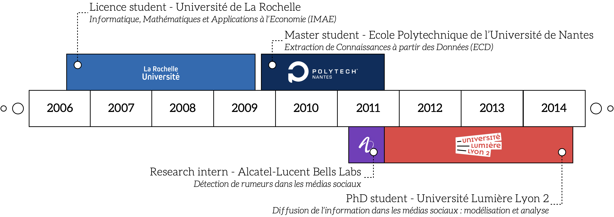

# About Me

## Education

## Research

I'm the head of the [Data Mining & Decision Group](https://eric.msh-lse.fr/recherche/equipe-dmd/) at the [ERIC Lab](https://eric.msh-lse.fr). My research interests lie in the development of machine learning and data mining techniques for the analysis and modeling of text, with the aim of solving real-world problems related to language.  Check out my work on  [document network embedding](document_network_embedding.md) and [social media mining](social_media_mining.md) or my work in [sociolinguistics](sociolinguistics.md).

- [Projects, students and service](research.md)
- [Publication list](publications.md) / [Google Scholar profile](https://scholar.google.com/citations?user=mM_oO18AAAAJ)
- [Code](code.md)

## Teaching

I teach courses in statistics and computer science, both at the undergraduate level ([BUT - Statistique et Informatique Décisionnelle @ Université Lumière Lyon 2](https://iut.univ-lyon2.fr/formations/but/b-u-t-statistique-et-informatique-decisionnelle)) and the graduate level ([Master - Data Mining @ Université Lumière Lyon 2](https://www.univ-lyon2.fr/master-2-informatique-data-mining-data-mining-1) & [DU - Data Science @ Université de Paris](https://iutparis-seine.u-paris.fr/metiers-de-la-data/diplome-duniversite-analyste-data-science/)).

- [Courses](teaching.md)

## Latest talks

- ECAS-SFdS (European courses in advanced statistics) - [Deep Learning for NLP](https://www.sfds.asso.fr/fr/ecas/632-home/)
- SciDoLySe Meeting (regional machine learning group) - [Tutorial on the Transformer architecture for NLP](http://scidolyse.ens-lyon.fr/sites/default/files/2021-05/guile_small.pdf)
- GdL ARIA / GdR TAL (national NLP group) - [Theory of graph convolutional networks](http://www.asso-aria.org/gdl/2021/20210115/)

## Contact

### E-Mail

Click <a href="mailto:adrien.guille&#64;univ-lyon2.fr">here</a> to e-mail me!

### Office
Université Lumière Lyon 2 - Campus Porte des Alpes Laboratoire ERIC Room K198
